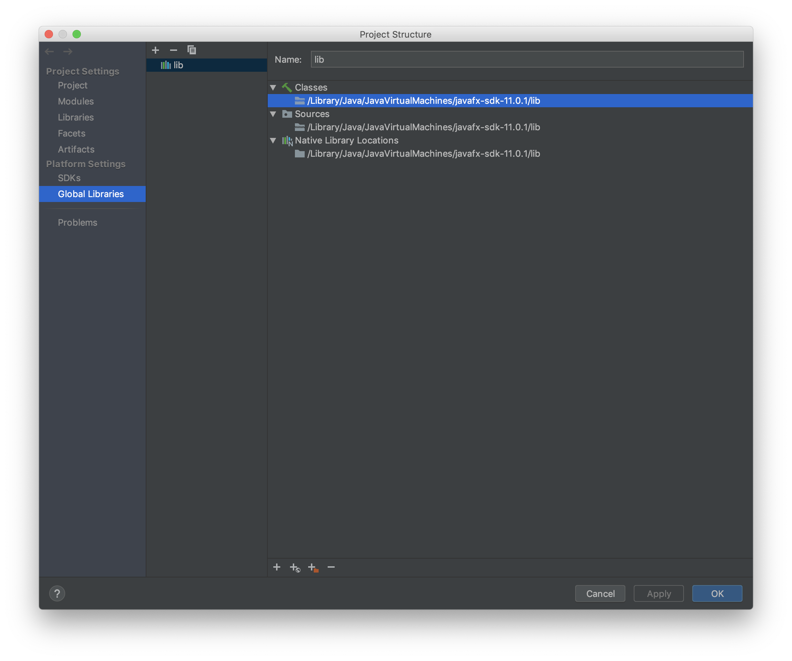
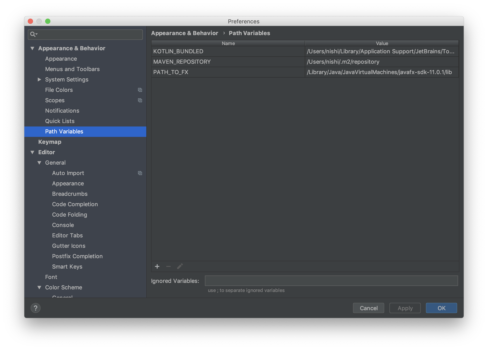

# Minesweeper

## 依存関係
- [JDK11](https://www.oracle.com/technetwork/java/javase/downloads/jdk11-downloads-5066655.html)
- [JavaFX Scene Builder](https://www.oracle.com/technetwork/java/javase/downloads/javafxscenebuilder-1x-archive-2199384.html)
- [JavaFX](https://gluonhq.com/products/javafx/)

## 環境構築
### IntelliJ IDEAでJDK 11を定義する
1. [JDK11](https://www.oracle.com/technetwork/java/javase/downloads/jdk11-downloads-5066655.html)をダウンロードしてインストールする
2. `Ctrl+Shift+Alt+S`(Windowsの場合),`⌘;`(Macの場合)を押してプロジェクト構造ダイアログを開く
3. 一番左のウィンドウのプラットフォーム設定で、`SDK`をクリック
4. 右側のペインの上で、 `+`をクリックし、JDKを選択
5. 表示されるダイアログで、JDKインストールディレクトリを選択し、OKをクリック
    - `C:\Program Files\Java\jdk-11.0.1`(Windowsの場合)
    - `/Library/Java/JavaVirtualMachines/jdk-11.0.1.jdk/Contents/Home`(Macの場合)
6. プロジェクト構造ダイアログでOKをクリック

### JavaFXのライブラリをダウンロード
1. [JavaFX](https://gluonhq.com/products/javafx/)をダウンロードして適当な場所に展開する
2. `Ctrl+Shift+Alt+S`(Windowsの場合),`⌘;`(Macの場合)を押してプロジェクト構造ダイアログを開く
3. 一番左のウィンドウのプラットフォーム設定で、`Global Libraries`をクリック
4. 右側のペインの上で、 `+`をクリックし、Javaを選択
5. 先程ダウンロードしたJavaFXをの`lib`ディレクトリを選択して追加

6. プロジェクト構造ダイアログでOKをクリック
7. `Ctrl+Alt+S`(Windowsの場合),`⌘,`(Macの場合)で設定を開く
8. `Path Variables`に`+`から`PATH_TO_FX`を追加し,先程のディレクトリを設定する 

## ビルド＆実行
`Main.java`を開いて右上の▶をクリックして実行できる